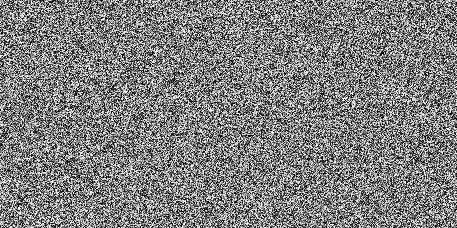
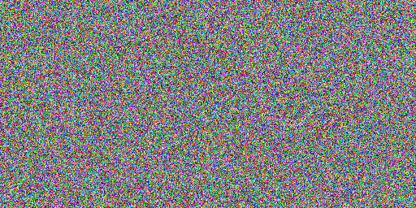

# Random image generation

This repo is for demonstrating how to generate a random single channel image.

## Requirements:
+ see the requirements.txt file and install all the dependencies to proceed further

## Executing project:
+ running below command generates a random black and white image
  ```
      python random_image_generation_bw.py
  ```
  + after executing the above command an image will get saved in your current folder, which will look something like this:
  
      

+ running below command generates a random color image
  ```
      python random_image_generation_color.py
  ```
  + after executing the above command an image will get saved in your current folder, which will look something like this:

    
