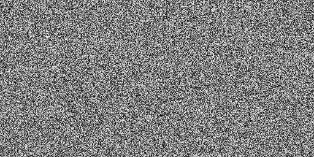

# image_generation_example

This repo is for demonstrating how to generate a random single channel image.

## Requirements:
+ see the requirements.txt file and install all the dependencies to proceed further

## Executing project:
+ for running the code simply execute the following command 
  ```
      python random_image_generation.py
  ```
+ after executing the above command an image will get saved in your current folder, which will look something like this:
      
